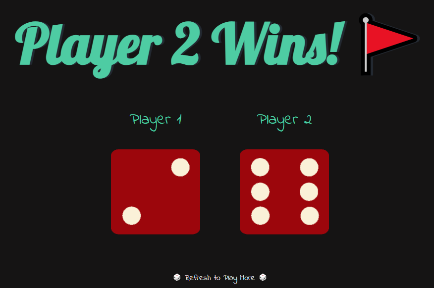

# Dice Game

The Dice Game is a simple and fun web-based game where two players roll dice to see who gets the higher number. Refresh the page to play again and determine the winner with each refresh!

## Preview

## How to Play ?

To play the Dice Game, simply checkout the deployed website [here](https://amit712singhal.github.io/Dice-Game/).

- The page will automatically roll the dice for both players upon loading.
- The player with the higher dice roll is declared the winner.
- Refresh the page to play again.
  
## Features

- Interactive gameplay with instant results on each page refresh.
- Visual representation of dice rolls for both players.
- Simple and intuitive user interface.
- Random number generation to simulate dice rolls.

## Credits

This project was created as part of a [Web Development Course](https://www.udemy.com/course/the-complete-web-development-bootcamp/) on Udemy. Credits go to Dr. Angela Yu for providing guidance and resources.

## License

This project is licensed under the MIT License. See the [LICENSE](./LICENSE) file for more information.
